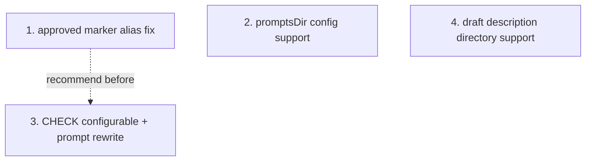

# Mission-Driver 明确可改问题 Roadmap（#1–#3, #5）

> Last updated: 2026-07-30
> Sources: `docs/analysis/2026-07-29-0000-mission-driver-actionable-fixes.md` (primary)

## Purpose

This roadmap tracks 4 root-cause-confirmed, directly-actionable fixes for the mission-driver engine. Terminal goal: REVIEW_PLANS no longer wastes correction calls, per-mission `promptsDir` enables non-implementation task reuse, CHECK is a configurable deterministic-state gate with auto-fix, and draft prompts explicitly support directory-based descriptions.

Does not contain implementation details. Each `planned` stage is owned by its execution plan.

## Work Item Status

> **This is the only dynamic state block. Update status only here.**
> The roadmap is a human-AI alignment artifact: humans set items and their order;
> AI takes the first `todo` item, drafts/executes plans (humans don't review individual
> plans), and writes the item back to `done` when closure audit passes.

- 1. REVIEW_PLANS approved marker alias fix: `done`
- 2. Per-mission promptsDir config support: `done`
- 3. CHECK configurable check command + prompt rewrite: `done`
- 4. Draft description supports directory/multi-file references: `done`

## Status values

| Status | Meaning |
| --- | --- |
| `todo` | Not started, no plan |
| `planned` | Has execution plan, passed draft review |
| `done` | Complete, passed closure audit |

## Framework / platform reuse

| Capability | Provider | Notes |
| --- | --- | --- |
| Flow JSON markerAliases | `flows/mission-driver.json` | Alias mechanism already exists; just add entry |
| projectPromptDirs override chain | `flow-loader.js:241-247` | Directory-priority lookup already implemented; extend to per-mission |
| commands.* delegate vars | `main.js:688-693` | testCmd/buildCmd/lintCmd already injected; add checkCmd alongside |
| Flow JSON step transitions | `flows/mission-driver.json` | retry transition pattern already used by EXECUTE in plan-execution.json |

## Current baseline

**Already shipped:**
- forEach agent step aggregation (`engine.js:991-1042`) — counts completed/failed, produces aggregate marker
- `projectPromptDirs` mechanism (`flow-loader.js:249-258`) — `missions/prompts/` overrides built-in prompts
- CHECK step runs `git status --porcelain` via `prompts/health-check.md`

**Main gaps (blocking generalization):**
- REVIEW_PLANS `approved` marker triggers correction agent (2 wasted parse-model calls per draft plan)
- All missions share one `missions/prompts/` override directory — no per-mission prompt customization
- CHECK hardcoded to git-status-only; cannot configure `mvn build` / `pnpm build` as deterministic-state gate
- health-check.md emphasizes "lightweight, do NOT run build" — contradicts configurable gate intent

## Stages

| # | Stage | Owner plan | Deps | Critical path | Reuse |
| --- | --- | --- | --- | --- | --- |
| 1 | REVIEW_PLANS approved marker alias fix | plan 1 | — | No (independent, trivial) | markerAliases mechanism |
| 2 | Per-mission promptsDir config support | plan 2 | — | **Yes** | projectPromptDirs chain |
| 3 | CHECK configurable check command + prompt rewrite | plan 3 | recommend 1 first (same flow JSON) | **Yes** | commands.* delegate vars, retry transition |
| 4 | Draft description supports directory/multi-file references | plan 4 | — | No (independent, trivial) | existing optional --target-file |

### 1. REVIEW_PLANS approved marker alias fix

> Status: see Work Items above

**Goal:** Eliminate wasted correction-agent calls by adding `"approved": "all_complete"` to `flows/mission-driver.json` markerAliases.

**Deliverables:**
- Add `"approved": "all_complete"` to `flows/mission-driver.json` markerAliases
- Verify CLOSURE_AUDIT's direct `"approved"` transition key still takes priority (no regression)
- Add/update test asserting forEach agent step per-item marker does not trigger correction

**Out of scope:** engine.js `_executeForEach` correction-skip refactor (deferred).

**Module / area:** `tools/mission-driver/flows/mission-driver.json`, `tools/mission-driver/test/`.

### 2. Per-mission promptsDir config support

> Status: see Work Items above

**Goal:** Add `promptsDir` to mission.json so each mission can override the full prompt set independently.

**Deliverables:**
- Add optional `promptsDir` field to mission.json schema (mission-check.mjs allows field)
- `config.js`: resolve `mission.promptsDir`, pass into config object as `missionPromptsDir`
- `main.js:668-671`: build `projectPromptDirs` as `[mission.promptsDir, missionsDir/prompts]` (prepend when set)
- `flow-loader.js:306-321`: `loadSubFlow` reads `config.missionPromptsDir` instead of hardcoding `missionsDir/prompts`
- Resolution chain becomes: `mission.promptsDir` → `missions/prompts/` → `TOOL_ROOT/prompts/`

**Out of scope:** goal-driven auto-selection of promptsDir (future feature).

**Module / area:** `tools/mission-driver/src/config.js`, `tools/mission-driver/src/main.js`, `tools/mission-driver/src/flow-loader.js`, `tools/mission-driver/src/mission-check.mjs`.

### 3. CHECK configurable check command + prompt rewrite

> Status: see Work Items above

**Goal:** Make CHECK a configurable deterministic-state gate: run `commands.check` when configured, auto-fix on failure, fall back to git-status when unconfigured.

**Deliverables:**
- Add `commands.check` to `missions/base.json` (optional, empty default)
- `main.js`: pass `checkCmd` delegate var (parallel to testCmd/buildCmd)
- Rewrite `prompts/health-check.md`: remove "lightweight/do NOT run build" framing; position as deterministic-state gate program; run `{{checkCmd}}` when configured; auto-fix on failure; fall back to git conflict-marker detection when unconfigured
- `flows/mission-driver.json`: change CHECK `fail` transition from `{ "done": "failed" }` to `{ "retry": "CHECK", "maxRetries": 2 }`; add `"onMaxRetries": { "done": "failed" }`

**Out of scope:** new gate-check.md prompt file (reuse health-check.md with conditional logic).

**Module / area:** `tools/mission-driver/prompts/health-check.md`, `tools/mission-driver/flows/mission-driver.json`, `missions/base.json`, `tools/mission-driver/src/main.js`.

### 4. Draft description supports directory/multi-file references

> Status: see Work Items above

**Goal:** Make draft prompts explicitly state that the description can reference directories, multiple files, or abstract goals — not limited to a single `--target-file`.

**Deliverables:**
- `prompts/mission-brief.md:9`: change "Target file (optional)" to "Target file or directory (optional) — the description may reference any path"
- `prompts/mission-draft.md`: add note that the user request may reference directories, multiple files, or abstract goals
- `main.js:850`: clarify `--target-file` help text as optional input aid, not a required constraint

**Out of scope:** interactive directory picker, new CLI flags.

**Module / area:** `tools/mission-driver/prompts/mission-brief.md`, `tools/mission-driver/prompts/mission-draft.md`, `tools/mission-driver/src/main.js`.

## Dependency graph

## Cross-cutting concerns

| Concern | Notes |
| --- | --- |
| Flow JSON contract | Items 1 and 3 both modify `flows/mission-driver.json`; do sequentially to avoid merge conflicts |
| Backward compatibility | Item 3 CHECK must fall back to git-status when `commands.check` is unconfigured (empty/missing) |
| Test verification | After all items: `pnpm --prefix tools/mission-driver test` must be green; `node tools/mission-driver/src/mission-check.mjs` must validate |
| Prompt-check.mjs | Item 3 rewrites health-check.md; `prompt-check.mjs` structural validation must still pass |
| Subflow prompt loading | Item 2 changes `loadSubFlow` prompt resolution; verify deep-audit-loop and plan-execution subflows still load prompts correctly |

## Rules

- This file is a state index and coarse decomposition, not an execution plan.
- Each `planned` stage is owned by its execution plan.
- Status changes happen only in the Work Items block at the top.
- Item 3 modifies Flow JSON contract (`ask-first` protected area) — its plan must include subagent review.

## Follow-up Backlog

P2 findings from the open-ended audit do not get their own plan; they live here, each with its source audit path so they stay traceable. The single [P1] finding from the same audit DID get its own plan and is recorded here as resolved for traceability.

- **[P1] `commands.check` not surfaced in mission-generation template — RESOLVED 2026-07-30.** The mdr-fix-3 feature (`commands.check` + configurable CHECK) was shipped and green but invisible on every mission-creation/doc surface; the `draft` agent never generated `check`, and the manuals' CHECK row factually contradicted shipped behavior (said CHECK runs tests/build/lint — exactly what `health-check.md` forbids). Surfaces `commands.check` in `prompts/mission-draft.md` (`commands` example + Notes, incl. shallow-merge reminder) and in both user manuals (en + zh `commands` examples + enumeration), and corrects the CHECK step rows to deterministic-state-gate semantics with `pass` / `needs_fix` / `fail`. Resolved by plan `docs/plans/mission-driver-actionable-fixes/2026-07-30-0902-1-surface-commands-check.md` (executed + closed; `pnpm --prefix tools/mission-driver test` → 597 pass / 0 fail, `prompt-check: OK`; no flow JSON / engine / mission-check.mjs / web-dist / dependency change).
  - Source: `docs/audits/mission-driver-actionable-fixes/2026-07-29-1620-open-audit-mission-driver-actionable-fixes.md` [P1] finding.

- **[P2] `context-map.mjs` `EXPECTED_VARS` line-number comments are stale** — `src/context-map.mjs:90-92` annotate `// main.js:5NN` references that drifted after the actionable-fixes work grew `main.js` (e.g. `checkCmd` is annotated `main.js:537` but the actual line is `main.js:700`; `commitFormat`/`multiAuditPrompt` both annotate `main.js:538`). Cosmetic comment rot only — the drift gate keys off live source extraction (`extractVarsKeysFromMainJs`), not these comments, so behavior is unaffected. The header at `context-map.mjs:71-74` already acknowledges these are point-in-time references. Trigger to promote into scope: whenever `EXPECTED_VARS` / `VAR_PROVENANCE` is next edited for a real change, refresh the line annotations in the same slice.
  - Source: `docs/audits/mission-driver-actionable-fixes/2026-07-29-1620-open-audit-mission-driver-actionable-fixes.md` [P2] finding #1.

- **[P2] `loadSubFlow` retains the dead `subflowDir` search-dir branch (pre-existing, explicitly adjudicated)** — `src/flow-loader.js:325-326` reads `this?.config?.subflowDir` and pushes it into `searchDirs`, but `src/config.js` never produces a `subflowDir` field, so the branch is unreachable in production. Pre-existing (not introduced by this mission); the mdr-fix-2 plan deliberately preserved it to keep the slice focused. Trigger to promote into scope: a future engine-hardening pass that collapses unreachable config-driven branches, or if `config.js` ever gains a `subflowDir` producer (which would make this branch live and require a real test).
  - Source: `docs/audits/mission-driver-actionable-fixes/2026-07-29-1620-open-audit-mission-driver-actionable-fixes.md` [P2] finding #2.
