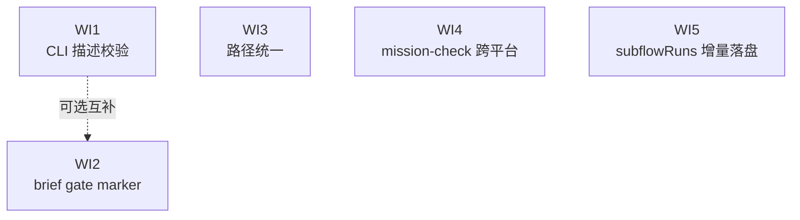

# Mission-Driver Draft Robustness Roadmap

> Last Updated: 2026-07-22 (mdr-remediate-1 closed — N4 design §4.3.1 plansRoot snippet dropped + annotated; F4/N1-arch architecture coverage gap closed via new `docs/architecture/mission-driver-baseline.md`; project-wide template-debt row added to Follow-up Backlog)
> Source: `tools/mission-driver/design/draft-robustness-design.md`

## Purpose

This roadmap drives the implementation of the draft-pipeline robustness fixes defined in `tools/mission-driver/design/draft-robustness-design.md`. It addresses three defects exposed by a `draft "d"` incident that produced three useless files (`d-brief.md` / `d-roadmap.md` / `tools/mission-driver/missions/d.json`).

It contains no implementation detail. The design doc owns the how; this file owns the what and the order.

## Work Item Status

> **This is the only dynamic status block. Update status here only.**
> Status lives on **work items**, never on milestones. AI takes the first `todo` work item in order, implements it automatically (humans do not review individual implementation), and writes it back to `done` on closure audit. See `docs/backlog/00-roadmap-authoring-guide.md`.

### M1 — Draft 输入与 gate

- WI1 CLI 层 draft 描述校验: `done`
- WI2 brief gate marker 契约 + 引擎强制: `done`

### M2 — 路径一致性

- WI3 draft/brief 路径统一走模板变量: `done`

### M3 — 校验工具健壮性

- WI4 修固 mission-check.mjs 跨平台 CLI 入口: `done`

### M4 — 执行状态持久化

- WI5 subflowRuns 增量落盘到主 run-state: `done`

## Status Values

| Status | Meaning |
| --- | --- |
| `todo` | Not started |
| `ready` | Draft-reviewed, queued for implementation |
| `done` | Completed and passed closure audit |

## Framework / Platform Reuse

Capabilities already provided by the stack, so this mission does not rebuild them:

| Capability | Provided by | Notes |
| --- | --- | --- |
| brief 产物路径解析 | `extractBriefPath` (`main.js:160-164`) | WI2 的 `extractBriefGate` 镜像此模式 |
| 模板变量注入 | `resolveTemplateVars` + `main.js:301,340` | WI3 直接在此加 `backlogDir` 变量 |
| draft-state patch 写入 | `writeDraftState` (`main.js:270-289`) | WI2 的 gate 字段走 patch 继承，无需改 schema |
| mission 身份解析 | `parseDraftArtifact` (`main.js:180-234`) | WI3 在此加路径校验 warn |
| draft 测试缝 | `__setRunnerFactoryForTest` (`main.js:24-29`) | WI2 用它注入 mock runner 测 gate 三分支 |
| mission 校验纯函数 | `validateMission` / `loadMission` (`mission-check.mjs:57,95`) | WI4 不改校验逻辑，仅修 CLI 入口触发；`run`/`list` 已通过函数调用正常使用 |
| step 记录流式 patch | `_onAgentStepUpdate` (`engine.js:415-424`) | WI5 的 `_wfAppendSubflowRun` 镜像此"找 running 记录 + patch + writeWorkflow"模式 |
| 原子写 run-state | `_writeWorkflow` (tmp+rename, `engine.js:404-413`) | WI5 每完成一个子流程多一次原子写，开销可忽略 |

## Current Baseline

**Already implemented:**

- `cmdDraftMission` 两段式管线（brief → draft），`main.js:244-384`。
- brief agent 输出 `<BRIEF_FILE>` marker，`extractBriefPath` 解析（`:160-164`）。
- `--skip-brief` 单段式向后兼容路径（`:248`）。
- draft-state.json 在 `--draft-job-dir` 模式下记录 phase / briefPath / missionName（`:270-289`）。
- draft-brief.test.js 测试缝（`__setRunnerFactoryForTest`）已就位。

**Main gaps (来自设计文档根因分析):**

- `cmdDraftMission` 对描述参数零校验，`"d"` / `"test"` / 空白都能通过。
- brief 的"是否放行"判定只在 prompt 文字层（`mission-draft.md:7`），引擎无条件进 Stage 2（`main.js:334+`），gate 强弱全看 AI 是否听话。
- draft 管线路径双轨：`{{missionsDir}}` 绝对解析 vs `docs/backlog/` 字面量相对解析，`projectRoot ≠ 仓库根` 时产物散落（`d` 事件中 mission.json 进了 `tools/mission-driver/missions/`，brief/roadmap 留在仓库根 `docs/backlog/`）。
- `mission-check.mjs:106` 独立 CLI 入口判断 `import.meta.url === \`file://${process.argv[1]}\`` 在 Windows 永不相等（左侧 `file:///C:/...`，右侧拼出 `file://C:\...`），CLI 主体从不执行 → `node mission-check.mjs <file> <root>` 静默 exit 0、什么都没校验。macOS/Linux 正常，是平台相关缺陷。`run`/`list` 子命令走 `loadMission` 函数调用不受影响。
- `engine.js:964` 的 `_executeSubflowStep` 把 `subflowRuns` 攒在局部变量、只在 forEach 结束 return 时写主 run-state。父进程中途被杀则主 run-state 的 `subflowRuns` 永远是初始 `[]`（aborted run 子流程历史对 `--analyze` 等直读消费方丢失）。monitor 侧渲染（`mergeSubflowChildren` 的 `status === "running"` gate）已在 commit 06749fa 修固，但 run-state.json 本身仍不自包含。

---

## Milestones

### M1 — Draft 输入与 gate

| Work Item | Status | Owner Doc | Dependencies | Reuse |
| --- | --- | --- | --- | --- |
| WI1 CLI 层 draft 描述校验 | `done` | `tools/mission-driver/design/draft-robustness-design.md` §4.1 | — | commander argument 校验 |
| WI2 brief gate marker 契约 + 引擎强制 | `done` | `tools/mission-driver/design/draft-robustness-design.md` §4.2 | — | `extractBriefPath` / `writeDraftState` |

### M2 — 路径一致性

| Work Item | Status | Owner Doc | Dependencies | Reuse |
| --- | --- | --- | --- | --- |
| WI3 draft/brief 路径统一走模板变量 | `done` | `tools/mission-driver/design/draft-robustness-design.md` §4.3 | — | `resolveTemplateVars` / `parseDraftArtifact` |

### M3 — 校验工具健壮性

| Work Item | Status | Owner Doc | Dependencies | Reuse |
| --- | --- | --- | --- | --- |
| WI4 修固 mission-check.mjs 跨平台 CLI 入口 | `done` | `tools/mission-driver/design/draft-robustness-design.md` §4.4 | — | `node:url` `pathToFileURL` |

### M4 — 执行状态持久化

| Work Item | Status | Owner Doc | Dependencies | Reuse |
| --- | --- | --- | --- | --- |
| WI5 subflowRuns 增量落盘到主 run-state | `done` | `tools/mission-driver/design/draft-robustness-design.md` §4.5 | — | `_onAgentStepUpdate` 模式 / `_writeWorkflow` |

---

## Work Item Details

### WI1 — CLI 层 draft 描述校验

> Status: see Work Item Status above

**Goal:** 在 `cmdDraftMission` 入口拦截明显无意义的描述（空、过短、纯占位），避免生成垃圾文件。

**Delivery scope:**

- 新增 `validateDraftDesc(desc)` 函数（`main.js:244` 之后、Stage 1 之前）：空 / `trim` 后长度 < 4 / 命中占位黑名单（test / asdf / foo / todo / xxx / none 等）→ 拒绝。
- 校验失败：打印 reason + 正面示例 hint，`process.exitCode = 1`，不进 Stage 1。
- 阈值（默认 4）通过 `base.json` 的 `draft.minDescLength` 可配置，有默认兜底。
- 不做语义校验（"是否有意义"交给 WI2 的 brief gate）。

**Out of scope:** 不改 `run` / `list` / `analyze` 等其它子命令的参数校验。

**Modules / areas:** `tools/mission-driver/src/main.js`

---

### WI2 — brief gate marker 契约 + 引擎强制

> Status: see Work Item Status above

**Goal:** 把 brief 的"是否放行"从 prompt 文字升级为结构化 marker，引擎据 marker 决定是否进 Stage 2。

**Delivery scope:**

- `prompts/mission-brief.md`（`:30` 附近）：在 `<BRIEF_FILE>` 之外新增 `<BRIEF_GATE>pass|blocked</BRIEF_GATE>` 与 `<BRIEF_GATE_REASON>...</BRIEF_GATE_REASON>` marker；写明 pass/blocked 判定规则（描述是否足以推导目标/范围/产物）。
- `main.js` 新增 `extractBriefGate(resultText)`（镜像 `extractBriefPath`，`:160-164`），正则取 gate + reason。
- Stage 1 之后（`:332` 附近）加分支：`gate === "blocked"` → 打印 reason + 指向 brief 文件、不进 Stage 2、`draft-state.status = "blocked"`、return；`gate === "pass"` → 进 Stage 2；`gate === null`（旧 brief 无 marker）→ 退化为旧行为继续 Stage 2（向后兼容）。
- `draft-state.json` 自然继承 `briefGate` / `briefGateReason` 字段（patch 合并），monitor draft-job UI 后续可展示。

**Out of scope:** 不改 monitor 前端（新字段对旧 UI 透明，UI 升级非阻塞）；不改 `--skip-brief` 单段式路径。

**Modules / areas:** `tools/mission-driver/src/main.js`, `tools/mission-driver/prompts/mission-brief.md`

---

### WI3 — draft/brief 路径统一走模板变量

> Status: see Work Item Status above

**Goal:** 消除 draft 管线的路径双轨制，让 brief / roadmap / mission.json 全部按 `projectRoot` 一致解析。

**Delivery scope:**

- `main.js:301`（brief 渲染）与 `:340`（draft 渲染）的 `resolveTemplateVars` 新增 `backlogDir = resolve(projectRoot, "docs/backlog")`（与 `plansRoot` 等）。
- `prompts/mission-brief.md`（`:13,27,30`）：`docs/backlog/<slug>-brief.md` → `{{backlogDir}}/<slug>-brief.md`。
- `prompts/mission-draft.md`（`:13`）：`docs/backlog/{mission-name}-roadmap.md` → `{{backlogDir}}/{mission-name}-roadmap.md`（`:19` 的 `{{missionsDir}}` 已是变量，不变）。
- `parseDraftArtifact`（`main.js:180-234`）：`<MISSION_FILE>` 命中后校验路径是否落在期望 `missionsDir` 下，不在则打 warn（不强制失败）。
- 不强制 `projectRoot = 仓库根`（从子模块发起 draft 是合法用法；基准统一即可）。

**Out of scope:** 不改 `run` 命令的路径解析；不改 `flow-loader.js` 的 `activePlans()` / `openAudits()` 扫描逻辑（属另一主题）。

**Modules / areas:** `tools/mission-driver/src/main.js`, `tools/mission-driver/prompts/mission-brief.md`, `tools/mission-driver/prompts/mission-draft.md`

---

### WI4 — 修固 mission-check.mjs 跨平台 CLI 入口

> Status: see Work Item Status above

**Goal:** 让 `mission-check.mjs` 独立 CLI 在 Windows / macOS / Linux 上都真正执行校验，消除"静默 exit 0 假阳性"。

**Delivery scope:**

- `mission-check.mjs:106` 入口判断从 `import.meta.url === \`file://${process.argv[1]}\`` 改为 `import.meta.url === pathToFileURL(process.argv[1]).href`（顶部 `import { pathToFileURL } from "node:url"`）。
- 不改 `validateMission` / `loadMission` 的校验逻辑本身（它们是纯函数，已正确；问题只在 CLI 入口没触发）。
- 加 `mission-check-cli.test.js`：`spawnSync` 跑 `node mission-check.mjs <bad-mission> .`，断言 exit 1 + stderr 含 "does not exist"，锁住独立 CLI 真执行校验。

**Out of scope:** 不把校验收进 commander 子命令形态（设计文档 §4.4.2 列为后续可选升级）；不改 `run`/`list` 走的 `loadMission` 函数路径。

**Modules / areas:** `tools/mission-driver/src/mission-check.mjs`

---

### WI5 — subflowRuns 增量落盘到主 run-state

> Status: see Work Item Status above

**Goal:** 让 forEach 子流程每完成一项就增量写入主 run-state.json 的 `subflowRuns`，父进程中途崩溃时 run-state 仍反映已完成项，不再永久停在初始 `[]`。

**Delivery scope:**

- 新增 `_wfAppendSubflowRun(stepName, visits, run)`（镜像 `_onAgentStepUpdate` `engine.js:415-424` 的"找 running 记录 + patch + writeWorkflow"模式）：在 `workflow.steps` 里按 name+visits+status==="running" 定位当前 subflow 步记录，append 到其 `subflowRuns`，原子写。
- `_executeSubflowStep` concurrency=1 路径（`:983`）与 sliding-window 的 `recordResult`（`:1011-1013`）在 `subflowRuns.push(...)` 之后立即调用 `_wfAppendSubflowRun`。
- 并发路径增量写时顺序可能是 resolve 序（非 forEachIndex）；最终 return 时局部 `subflowRuns.sort(...)`（`:1050`）仍修正，`_wfClose` 用最终顺序覆盖。增量期间的临时乱序只影响实时观察。
- 加 `subflow-incremental.test.js`：mock forEach=3，第 2 项完成后模拟父进程状态丢失（直接读磁盘 run-state.json），断言 `subflowRuns.length === 2` 且记录正确。

**Out of scope:** 不改 monitor 侧渲染（已在 commit 06749fa 修固）；不改子流程自己的 run-state 文件写入（子引擎已正确落盘）；不改 `_wfClose` 的最终覆盖语义。

**Modules / areas:** `tools/mission-driver/src/engine.js`

---

## Dependency Graph

五个 WI 相互独立、可并行。WI1 与 WI2 是互补关系（WI1 拦明显垃圾、WI2 拦语义不足），但无代码依赖；WI3、WI4、WI5 完全独立。建议 WI4 最先做（一行改动，让后续 WI 的"校验通过"可信）；WI5 的 monitor 侧渲染已修（06749fa），engine 侧补丁可择期做。

## Cross-Cutting

| Concern | Notes |
| --- | --- |
| 向后兼容 | `--skip-brief` 路径不受影响；旧 brief 无 `<BRIEF_GATE>` marker 时 `gate=null` 退化旧行为；旧 draft-state.json 无 gate 字段时 `?? null` 兜底。 |
| 测试 | 每个 WI 配套单元测试（见设计文档 §7）。`brief-gate.test.js` 用 `__setRunnerFactoryForTest` 注入 mock runner 覆盖 pass/blocked/null 三分支。验证命令：`pnpm --prefix tools/mission-driver test`。 |
| 零依赖约束 | 三个 WI 均不引入新 npm 依赖（纯正则 + 路径处理）。 |
| 与 step-audit mission 的关系 | 本 roadmap 与 `mission-driver-step-audit-roadmap.md` **完全独立**（无代码依赖、无执行顺序约束），可并行或交错实施。 |
| Owner-doc sync | WI3 闭合后更新 `tools/mission-driver/design/mission-design.md` 的 draft 两段式说明（路径基准统一为 projectRoot）；WI2 闭合后更新 brief marker 契约描述。 |
| Dev log | 每个 WI 闭合后按 `AGENTS.md` 写 `docs/logs/{year}/{month}-{day}.md`。 |

## Follow-up Backlog (post-mission residuals)

> Tracked watch-only items promoted out of plans' Deferred But Adjudicated sections when the underlying state-machine gap closed but a small residual remained. Promotion into active scope happens only when the trigger fires (e.g. user feedback, recurring audit finding).

| Item | Priority | Trigger for promotion | Acceptance criterion | Source |
| --- | --- | --- | --- | --- |
| Monitor draft-job UI rendering of `failed` / `rejected` draft-job status | `P3` (cosmetic) | User feedback that `failed` text is misread as `running` due to lack of visual distinction (e.g. color/icon). | Monitor RunList / RunDetail visually distinguishes `status: "failed"` / `phase: "rejected"` from `status: "running"` (color, icon, or label treatment); `statusTagType` extended to cover `failed`. | `2026-07-21-0954-2-cli-draft-desc-validate.md` Deferred (closed by mdr-remediate-3 A1 — state machine no longer lies; only styling residual remains) |
| Project-wide architecture template-debt paydown (`docs/architecture/system-baseline.md` + `module-boundaries.md` + `project-vision.md` still "Fill In" stubs) | `P3` (template debt) | A second cross-cutting tool lands (beyond mission-driver), or a copied project needs the runtime/module-boundary baseline to make decisions. | `system-baseline.md` filled in with the real runtime / frontend / backend / state / data-access / testing / build / deployment stack; `module-boundaries.md` filled in with real responsibility + allowed/forbidden dependencies per module; `project-vision.md` filled in with product goal / users / constraints / non-goals. | `2026-07-21-1605-1-design-and-architecture-doc-sync.md` Phase 2 (F4/N1-arch — mission-driver coverage closed via `mission-driver-baseline.md`; the broader template stubs remain as project-wide debt tracked here) |

## Rule

- 本文件是状态索引与粗粒度拆分，不是实现规格。实现细节由设计文档 `draft-robustness-design.md` 拥有。
- Work item 状态变更只更新顶部 Work Item Status 块。
- 里程碑不带状态；进度由扫描其 work items 得出。
- 不在 roadmap 里重复设计文档的代码片段 / 备选方案 / 正则细节。
