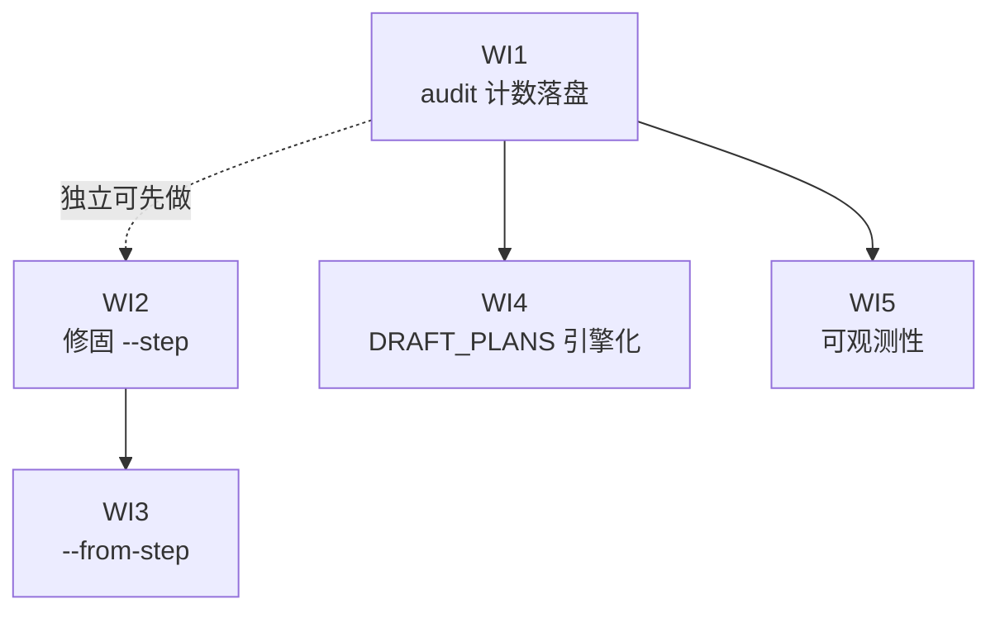

# Mission-Driver Step Execution & Audit Count Roadmap

> Last Updated: 2026-07-21 (WI1 → done; WI2 → done; WI3 → done; WI4 → done; WI5 → done)
> Source: `tools/mission-driver/design/step-execution-and-audit-count-design.md`

## Purpose

This roadmap drives the implementation of the step-execution-modes and deep-audit-count optimization defined in `tools/mission-driver/design/step-execution-and-audit-count-design.md`. After reading it, an AI or maintainer knows which work items are not started, ready, or completed without re-walking every doc and the codebase.

It contains no implementation detail. The design doc owns the how; this file owns the what and the order.

## Work Item Status

> **This is the only dynamic status block. Update status here only.**
> Status lives on **work items**, never on milestones. AI takes the first `todo` work item in order, implements it automatically (humans do not review individual implementation), and writes it back to `done` on closure audit. See `docs/backlog/00-roadmap-authoring-guide.md`.

### M1 — Audit 计数权威化

- WI1 audit 计数落盘到 run-state.json: `done` → plan `docs/plans/mission-driver-step-audit/2026-07-20-1147-1-audit-count-persist.md`

### M2 — 步骤执行模式

- WI2 修固 `--step` 单步执行（maxSteps=1）: `done` → plan `docs/plans/mission-driver-step-audit/2026-07-20-1147-2-single-step-fix.md`
- WI3 新增 `--from-step` 入口覆盖: `done` → plan `docs/plans/mission-driver-step-audit/2026-07-20-1147-3-from-step-entry.md`

### M3 — DRAFT_PLANS 决策引擎化

- WI4 DRAFT_PLANS 删 done 出口 + audit-gate + prompt 改造: `done` → plan `docs/plans/mission-driver-step-audit/2026-07-20-1559-1-draft-plans-audit-gate.md`

### M4 — 可观测性收尾

- WI5 events/日志/monitor 展示 audit 计数: `done` → plan `docs/plans/mission-driver-step-audit/2026-07-20-1559-2-audit-count-observability.md`

## Status Values

| Status | Meaning |
| --- | --- |
| `todo` | Not started |
| `ready` | Draft-reviewed, queued for implementation |
| `done` | Completed and passed closure audit |

## Framework / Platform Reuse

Capabilities already provided by the stack, so this mission does not rebuild them:

| Capability | Provided by | Notes |
| --- | --- | --- |
| 状态机循环 / transition 解析 | `tools/mission-driver/src/engine.js` `FlowEngine.run()` | 已支持 `entryOverride`（任意入口），WI3 直接复用 |
| 表达式函数 `openAudits()` / `activePlans()` | `tools/mission-driver/src/flow-loader.js` `createExpressionFunctions` | WI4 audit-gate 复用，不新写扫描逻辑 |
| 原子写 run-state | `engine.js` `_writeWorkflow` (tmp+rename) | WI1 直接复用，保证计数落盘原子性 |
| 主/子流程区分 | `config.isSubflow` | WI1 用此判断只在主流程计 audit 轮次 |
| CLI option 注册 | `src/main.js` commander 定义 | WI2/WI3 复用 option + 互斥校验模式 |
| monitor REST + SSE | `src/monitor.js` `GET /api/runs/:id` | WI5 在现有端点 payload 加字段 |

## Current Baseline

**Already implemented:**

- 主流程 `mission-driver.json`：CHECK → REVIEW → EXEC → DRAFT → DEEP_AUDIT 五步循环，`maxAuditRounds: 3`，`auditEntry: "DEEP_AUDIT"`。
- `maxAuditRounds` 上限由 `engine.js:1344` 用内存 `visitCounts` 强制（第 4 次进入 DEEP_AUDIT → completed）。
- `--step <STEP>` 单步调试入口（`main.js:583-597`，靠 transition 就地改写实现）。
- `--fast` / `--skip-steps` 跳步机制（`engine.js:1391`，`effectiveSkip` Set）。
- run-state.json 已有 `pid` / `status` / `steps[]` / `currentStep` 等字段，原子写就绪。

**Main gaps (来自设计文档根因分析):**

- `--step` 只改写 `transitions`，漏了 `onError/onUnknown/onMaxRetries`，异常出口让单步逃逸成完整循环。
- 没有 `--from-step`（入口覆盖 + 保留 transitions）模式。
- `maxAuditRounds` 计数只在内存，不落盘；monitor / 复盘 / AI 都看不到。
- DRAFT_PLANS 让 AI 自判"audit 是否做过"，AI 混淆 plan 级 closure audit 与 mission 级 deep audit → 误输出 `done` 提前结束，无法稳定进入 DEEP_AUDIT。

---

## Milestones

### M1 — Audit 计数权威化

| Work Item | Status | Owner Doc | Dependencies | Reuse |
| --- | --- | --- | --- | --- |
| WI1 audit 计数落盘到 run-state.json | `done` | `tools/mission-driver/design/step-execution-and-audit-count-design.md` §4.1 | — | `_writeWorkflow` / `config.isSubflow` |

### M2 — 步骤执行模式

| Work Item | Status | Owner Doc | Dependencies | Reuse |
| --- | --- | --- | --- | --- |
| WI2 修固 `--step` 单步执行（maxSteps=1） | `done` | `tools/mission-driver/design/step-execution-and-audit-count-design.md` §4.3.1 | — | engine `run()` 循环上界 |
| WI3 新增 `--from-step` 入口覆盖 | `done` | `tools/mission-driver/design/step-execution-and-audit-count-design.md` §4.3.2 | WI2 | `engine.run(entryOverride)` |

### M3 — DRAFT_PLANS 决策引擎化

| Work Item | Status | Owner Doc | Dependencies | Reuse |
| --- | --- | --- | --- | --- |
| WI4 DRAFT_PLANS 删 done 出口 + audit-gate + prompt 改造 | `done` | `tools/mission-driver/design/step-execution-and-audit-count-design.md` §4.2 | WI1 | `openAudits()` / `activePlans()` |

### M4 — 可观测性收尾

| Work Item | Status | Owner Doc | Dependencies | Reuse |
| --- | --- | --- | --- | --- |
| WI5 events/日志/monitor 展示 audit 计数 | `done` | `tools/mission-driver/design/step-execution-and-audit-count-design.md` §4.4 | WI1 | `_emitEvent` / `GET /api/runs/:id` |

---

## Work Item Details

### WI1 — audit 计数落盘到 run-state.json

> Status: see Work Item Status above

**Goal:** 在 run-state.json 中持久化本 run 已执行的 DEEP_AUDIT 轮次数，作为后续所有 audit 相关判断的权威源。

**Delivery scope:**

- `_initWorkflow`（`engine.js:303`）新增 `auditRound: 0` 与 `maxAuditRounds` 两个顶层字段。
- `_wfOpen`（`engine.js:325`）在主流程（`!isSubflow && name === auditEntry`）时 `auditRound++`，递增时机在步骤开始即落盘。
- `engine.js:1344` 的 maxAuditRounds 闸门改读 `workflow.auditRound`；注意 `_wfOpen` 与闸门的先后（设计文档 §5.2 写法 2：先判"是否允许进入"用递增前值，再 `_wfOpen` 递增）。
- 旧 run-state.json（无新字段）`?? 0` 兜底，行为等同"本 run 未跑过 audit"。

**Out of scope:** 不改 prompt、不改 DRAFT_PLANS 决策（留给 WI4）；不进 monitor 展示（留给 WI5）。

**Modules / areas:** `tools/mission-driver/src/engine.js`

---

### WI2 — 修固 `--step` 单步执行（maxSteps=1）

> Status: see Work Item Status above

**Goal:** 让 `--step X` 无论 X 的哪条出口（transitions / onError / onUnknown / onMaxRetries / retry）触发，都物理上只跑一步。

**Delivery scope:**

- 删除 `main.js:583-597` 的 transition 就地 mutation 整段。
- 在 config 上设 `singleStep: true` 标志传入 engine。
- `engine.run()`（`engine.js:1288`）新增 `maxSteps = cfg.singleStep ? 1 : Infinity` 循环上界。
- 因 `maxSteps` 退出时返回新 status `single_step_done`；`main.js:617` exitMap 映射到 exit code 0。
- 不再依赖 transition 改写，flow 对象保持不可变。

**Out of scope:** 不新增 `--from-step`（WI3）；不改 `--fast` / `--skip-steps` 语义。

**Modules / areas:** `tools/mission-driver/src/main.js`, `tools/mission-driver/src/engine.js`

---

### WI3 — 新增 `--from-step` 入口覆盖

> Status: see Work Item Status above

**Goal:** 支持从指定 step 开始执行、之后照常循环（不动 transitions），满足"今天就跑一次 deep audit 然后接着循环"类诉求。

**Delivery scope:**

- `main.js` run 子命令新增 `--from-step <step>` option（与 `--step` 互斥，同时传报错）。
- 指向不存在 / 子流程内部 step 时报错并复用 `getTopSteps()`（`main.js:68-72`）列出可用 step。
- 命中时 `config.entryStep = opts.fromStep`、`config.singleStep = false`，直接交给 `engine.run(entryOverride)`（已支持，`engine.js:1278`），无需引擎改动。
- README / help 文本补 `--from-step` 用法。

**Out of scope:** 不改子流程内部步骤作为入口的支持（仍只接受主流程 step）。

**Modules / areas:** `tools/mission-driver/src/main.js`

---

### WI4 — DRAFT_PLANS 删 done 出口 + audit-gate + prompt 改造

> Status: see Work Item Status above

**Goal:** 把"是否进入 DEEP_AUDIT / mission 是否完成"的决策从 AI 自判改为引擎据 `auditRound` 决定，消除 plan 级与 mission 级 audit 的混淆。

**Delivery scope:**

- `flows/mission-driver.json` DRAFT_PLANS（`:59-71`）：删 `transitions.done`；`onMaxRetries` 改为 `done: failed`；移除 `markerAliases` 中 `"done": "complete"`（`:23`）。
- 引擎 transition 解析处新增 audit-gate：`currentStep === DRAFT_PLANS && marker === nothing` 时，按设计文档 §4.2.4 真值表判断 completed vs goto DEEP_AUDIT（`auditRound >= maxAuditRounds && openAudits().length === 0 && activePlans().length === 0` → completed）。
- gate 判定收敛到一个命名函数（如 `_shouldCompleteOnAuditQuota`），仅当 `flow.auditEntry` 存在时生效，保持引擎对无 audit 概念的 flow 零侵入。
- `prompts/draft-from-roadmap.md`（`:27-43`）：删 `done` 分支；加"不要判断 audit 是否做过、引擎按轮次计数决定"提示；点名 `docs/audits/` 里 plan 级 closure audit 产物不要碰。

**Out of scope:** 不改 deep-audit-loop 子流程内部步骤；不细化 `_scanOpenAuditsList` 按 audit type 区分（设计文档 §5.4 列为推荐后续改进，不强制）。

**Modules / areas:** `tools/mission-driver/flows/mission-driver.json`, `tools/mission-driver/src/engine.js`, `tools/mission-driver/prompts/draft-from-roadmap.md`

---

### WI5 — events/日志/monitor 展示 audit 计数

> Status: see Work Item Status above

**Goal:** 让 audit 轮次在生产链路全部可见——events、日志、monitor dashboard、`--analyze` 复盘。

**Delivery scope:**

- `_emitEvent("step_started", ...)`（`engine.js:1352`）payload 新增 `auditRound`（当步骤是 auditEntry 时）。
- `engine.js:1350` 的 `_log` 行在 audit 步骤时追加 `(audit round N/M)`。
- `monitor.js` `GET /api/runs/:id` 返回 `auditRound` / `maxAuditRounds`。
- 前端 RunDetail 顶部展示 "Deep Audit: N / M"。
- postmortem prompt 注入 `auditRound`，让 `--analyze` 复盘知道跑了几轮。

**Out of scope:** 不改前端图表；不做历史 run 的 audit 计数回填（旧 run-state 无字段，显示为 0 / 未知即可）。

**Modules / areas:** `tools/mission-driver/src/engine.js`, `tools/mission-driver/src/monitor.js`, `tools/mission-driver/web/`, `tools/mission-driver/prompts/run-postmortem.md`

---

## Dependency Graph

WI1 是枢纽（WI4/WI5 依赖它）；WI2 独立可并行；WI3 依赖 WI2 的 singleStep 区分逻辑。

## Cross-Cutting

| Concern | Notes |
| --- | --- |
| 向后兼容 | 旧 run-state.json（无 `auditRound`）`?? 0` 兜底；旧 flow JSON（无 `maxAuditRounds`）退化为不启用 audit-gate。flow 升级与 prompt 升级**同批**发布（WI4）。 |
| 测试 | 每个 WI 配套单元测试：`audit-count.test.js` / `single-step.test.js` / `from-step.test.js` / 决策真值表四行用例。验证命令：`pnpm --prefix tools/mission-driver test`。 |
| 零依赖约束 | 引擎核心保持零 npm 依赖（`CONTEXT.md`）。WI1/WI2/WI4 不引入新依赖；WI5 前端用已有 Naive UI 组件。 |
| Owner-doc sync | WI4 闭合后更新 `tools/mission-driver/design/mission-driver-flow-design.md`（主流程 mermaid 与 DRAFT_PLANS 出口变化）；WI1 闭合后更新 `flow-engine-design.md` 的 run-state schema 段。 |
| Dev log | 每个 WI 闭合后按 `AGENTS.md` 写 `docs/logs/{year}/{month}-{day}.md`。 |
| 时序陷阱 | WI1 必须正确处理 `_wfOpen` 递增与 maxAuditRounds 闸门的先后（设计文档 §5.2 写法 2），否则 off-by-one。 |

## Rule

- 本文件是状态索引与粗粒度拆分，不是实现规格。实现细节由设计文档 `step-execution-and-audit-count-design.md` 拥有。
- Work item 状态变更只更新顶部 Work Item Status 块。
- 里程碑不带状态；进度由扫描其 work items 得出。
- 依赖以 Dependency Graph 与各 Milestone 表格为准；冲突时表格优先。
- 不在 roadmap 里重复设计文档的决策真值表 / 代码片段 / 备选方案。
